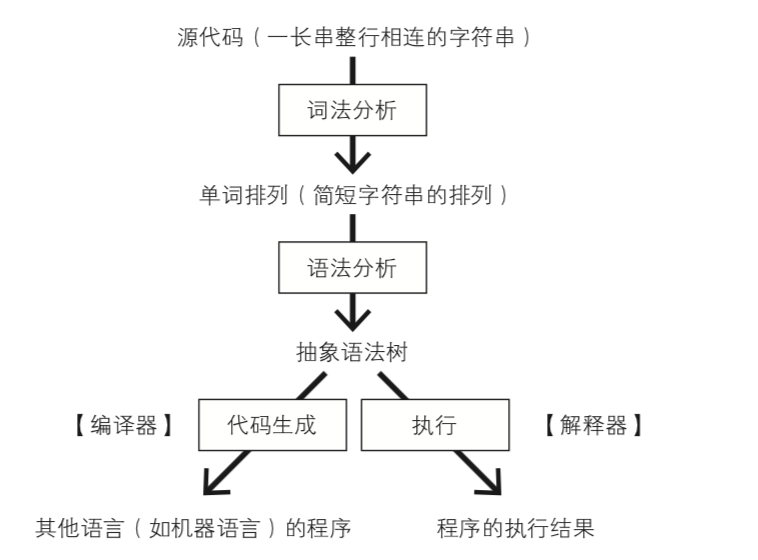

## AST 描述

AST 是源代码的抽象语法结构树状表现形式。
抽象语法树也用于程序分析和程序转换系统。

抽象语法树有什么用呢

1. IDE 的错误提示、代码格式化、代码高亮、代码自动补全等
2. JSLint、JSHint、ESLint 对代码错误或风格的检查等
3. webpack、rollup 进行代码打包等
4. Babel 转换 ES6 到 ES5 语法
5. 注入代码统计单元测试覆盖率

## 解析器 Parser

JavaScript Parser 是把 js 源码转化为抽象语法树的解析器，一般分为词法分析、语法分析及代码生成或执行。


一款编译器的编译流程是很复杂的，但我们只需要关注词法分析和语法分析，这两步是从代码生成 AST 的关键所在。

**测试源码**

```
// 注释
const a = 10;
console.log(a);
```

### 词法分析

它读取我们的代码，然后把它们按照预定的规则合并成一个个的标识 tokens。同时，它会移除空白符、注释等。最后，整个代码将被分割进一个 tokens 列表（或者说一维数组）。

当词法分析源代码的时候，它会一个一个字母地读取代码，所以很形象地称之为扫描 - scans。当它遇到空格、操作符，或者特殊符号的时候，它会认为当前内容已经完成了。

测试源码词法分析-转成

```
[
    {
        "type": "Keyword",
        "value": "const"
    },
    {
        "type": "Identifier",
        "value": "a"
    },
    {
        "type": "Punctuator",
        "value": "="
    },
    {
        "type": "Numeric",
        "value": "10"
    },
    {
        "type": "Punctuator",
        "value": ";"
    },
    {
        "type": "Identifier",
        "value": "console"
    },
    {
        "type": "Punctuator",
        "value": "."
    },
    {
        "type": "Identifier",
        "value": "log"
    },
    {
        "type": "Punctuator",
        "value": "("
    },
    {
        "type": "Identifier",
        "value": "a"
    },
    {
        "type": "Punctuator",
        "value": ")"
    },
    {
        "type": "Punctuator",
        "value": ";"
    }
]
```

### 语法分析

根据词法分析的结果，确定词语之间的关系，确定词语最终的表达含义，生成抽象语法树。
同时，验证语法。语法如果有错的话，抛出语法错误。

当生成抽象语法树的时候，解析器会删除一些没必要的标识 tokens（比如：不完整的括号），因此 AST 不是 100% 与源码匹配的。

测试源码语法分析-转成

```
{
    "type": "Program",
    "body": [
        {
            "type": "VariableDeclaration",
            "declarations": [
                {
                    "type": "VariableDeclarator",
                    "id": {
                        "type": "Identifier",
                        "name": "a"
                    },
                    "init": {
                        "type": "Literal",
                        "value": 10,
                        "raw": "10"
                    }
                }
            ],
            "kind": "const"
        },
        {
            "type": "ExpressionStatement",
            "expression": {
                "type": "CallExpression",
                "callee": {
                    "type": "MemberExpression",
                    "computed": false,
                    "object": {
                        "type": "Identifier",
                        "name": "console"
                    },
                    "property": {
                        "type": "Identifier",
                        "name": "log"
                    }
                },
                "arguments": [
                    {
                        "type": "Identifier",
                        "name": "a"
                    }
                ]
            }
        }
    ],
    "sourceType": "script"
}
```

## AST

### 常见的 AST node 类型

AST 树每一层结构也被叫做节点(Node)。一个 AST 可以由单一的节点或是成百上千个节点够成，通过组合在一起来描述静态分析的程序语法(静态分析是在不需要执行代码的前提下对代码进行分析的处理过程 （执行代码的同时进行代码分析即是动态分析）。 静态分析的目的是多种多样的， 它可用于语法检查，编译，代码高亮，代码转换，优化，压缩等等场景。)。

### AST 工具

1. [生成的 AST 树可视化工具:esprima](https://esprima.org/demo/parse.html#)

2. [源码生成 AST 抽象语法树](https://github.com/jquery/esprima)

3. [遍历并更新 AST:estraverse](https://github.com/estools/estraverse)
   estraverse.traverse JS 语法树遍历各节点，这是同步且按顺序递归的，如它会先递归一个节点到节点内没有 type 属性，然后才会递归第二个同级节点，所以可以利用这个效果做一些缓存节点的操作，后续满足条件后拿出来缓存节点来进行一些操作，这样就可以一定程度上实现优化，因为语法树很大机率是很大的树结构，会很耗性能。

4. [AST 重新生成源码:escodegen](https://github.com/estools/escodegen)

### Babel 的运行原理

Babel 的工作过程经过三个阶段，parse、transform、generate

1. parse 阶段，将源代码转换为 AST
2. transform 阶段，利用各种插件进行代码转换
3. generator 阶段，再利用代码生成工具，将 AST 转换成代码

其实就是它创建了 AST，遍历树，修改 tokens，最后从 AST 中生成新的代码。

### 例子

```
npm install
npm start
```

去除 demo 代码里的`console.log`与给`parseInt`添加第二个参数为 10;

至于怎么做了，其实就是把代码在[生成的 AST 树可视化工具:esprima](https://esprima.org/demo/parse.html#)网站转换下，观察去除`console.log`后的 AST 代码，寻找规则，然后编写规则。

而 babel 其实也是实现了大量的转换规则函数来做到转换代码的。
从这可知为什么 babel 那么消耗性能，需要做优化之类的。

**[抽象语法树 AST](https://juejin.im/post/5e942d926fb9a03c7d3d07a4?utm_source=gold_browser_extension)**

## fs-extra

[文件读写的使用](https://github.com/jprichardson/node-fs-extra/blob/master/docs/outputFile.md)

```
// With async/await:
async function example (f) {
  try {
    await fs.outputFile(f, 'hello!')

    const data = await fs.readFile(f, 'utf8')

    console.log(data) // => hello!
  } catch (err) {
    console.error(err)
  }
}

example(file)
```
